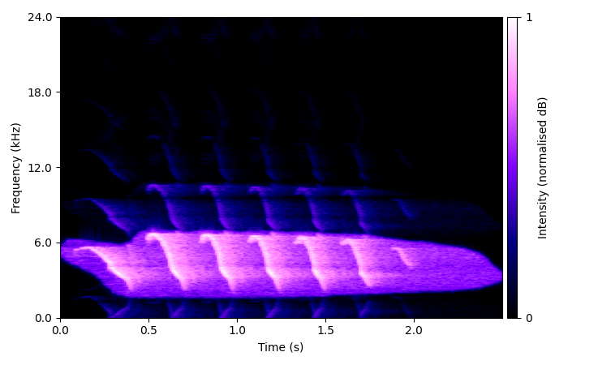
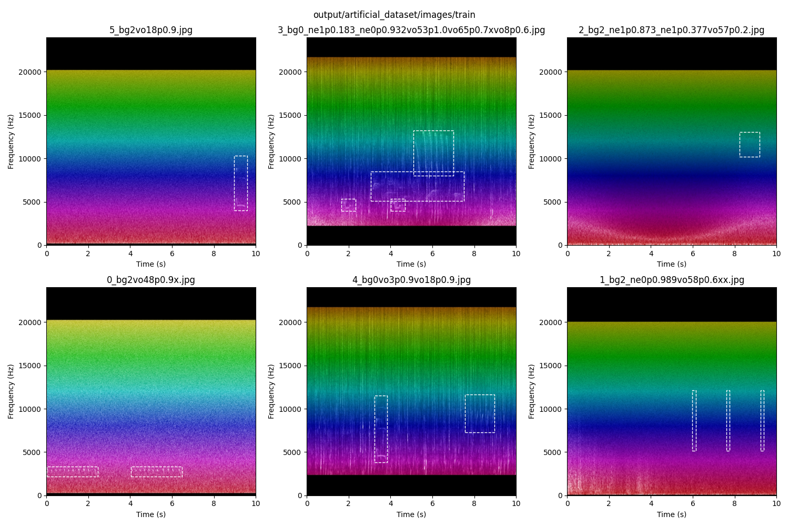

# bioacoustic data augmentation pipeline

todo: gpu-accelerate

### - edit config.yaml

### - provide dataset folder path containing:
1. audio of individual mask-cropped vocalisations (details below)
2. mask-cropped 'negative' examples for adversarial (optional, details below)
3. background noise (files must be longer than output length, default 10s)

each category may have a tags.csv file containing:
- a 'filename' column.
- vocalisations csv needs 'species' column to get labelled output.
- (optional) noise can have a csv with 'highpass' and 'lowpass' columns. these constrain the bandpass filter applied to soundscapes generated using that noise clip.
- negative category doesn't need a tags file but it won't break anything.

example folder structure:

    dataset/
        vocalisations/
            1.wav
            tags.csv
        negative/
            3.wav
        noise/
            2.wav
            tags.csv

vocalisations and negative should be cropped from background:

### output

primary outputs spectrograms in {output}/artificial_dataset 
image + label, train + test 
images and labels are associated by filename 

